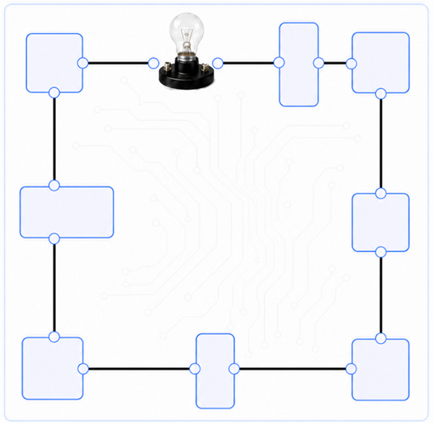
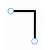
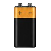
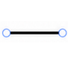

# ⚡ Circuito Eléctrico

Juego educativo e interactivo para aprender sobre circuitos eléctricos. El jugador debe completar un circuito arrastrando las piezas correctas a sus casilleros correspondientes.

> 🎮 **Jugable directamente en el navegador — sin instalación, sin servidor.**  
> 📱 **Optimizado para dispositivos móviles (touch) y escritorio (mouse).**

---

## 📸 Vista del juego



---

## 🕹️ Cómo jugar

1. **Observá el circuito** — el diagrama muestra los casilleros vacíos donde van las piezas.
2. **Arrastrá las piezas** del banco inferior hacia los casilleros del circuito.
   - ✅ Casillero con **borde verde** → pieza correcta.
   - ❌ Casillero con **borde rojo** → pieza incorrecta.
3. **Completá los 8 casilleros** para habilitar el botón *Probar Circuito*.
4. Presioná **⚡ Probar Circuito**:
   - Si todas las piezas están en su lugar → **¡las lámparas se encienden!** 💡
   - Si hay algún error → aparece un mensaje indicando cuántas piezas están mal.
5. Usá **↩ Deshacer** para revertir el último movimiento o **↺ Reiniciar** para empezar de cero.

---

## 🧩 Piezas disponibles

| Pieza | Imagen | Cantidad | Descripción |
|-------|--------|----------|-------------|
| Lámpara |  | 1 | Fuente de luz del circuito |
| Esquina |  | 4 | Conector de giro — se rota automáticamente |
| Switch |  | 1 | Interruptor del circuito |
| Batería |  | 1 | Fuente de energía |
| Línea |  | 1 | Conector recto |

---

## 🗺️ Niveles

| Nivel | Tipo | Estado |
|-------|------|--------|
| 1 | Circuito en **serie** | ✅ Disponible |
| 2 | Circuito en **paralelo** | 🔒 Próximamente |

El **Nivel 2** se desbloquea al completar el Nivel 1 correctamente.

---

## 🚀 Cómo ejecutar

### Opción 1 — Abrir directamente
Descargá o cloná el repositorio y abrí `index.html` en cualquier navegador moderno:

```
doble click → index.html
```

### Opción 2 — Clonar con Git

```bash
git clone https://github.com/TU_USUARIO/CircuitoElectrico.git
cd CircuitoElectrico
# Abrí index.html en tu navegador
```

### Opción 3 — Servidor local (opcional)

```bash
# Con Python
python -m http.server 8080

# Con Node.js (npx)
npx serve .
```

Luego entrá a `http://localhost:8080` en el navegador.

---

## 📁 Estructura del proyecto

```
CircuitoElectrico/
├── index.html          ← Estructura del juego (HTML5)
├── style.css           ← Estilos (mobile-first, dark theme)
├── game.js             ← Lógica del juego (vanilla JS)
├── .gitignore
├── README.md
└── images/
    ├── serial_circuit.png  ← Diagrama del circuito en serie
    ├── lamp.png            ← Pieza: lámpara
    ├── corner.png          ← Pieza: esquina (×4)
    ├── switch.png          ← Pieza: interruptor
    ├── battery.png         ← Pieza: batería
    └── line.png            ← Pieza: línea recta
```

---

## 🛠️ Tecnologías

- **HTML5** — estructura semántica
- **CSS3** — diseño mobile-first, dark mode, animaciones
- **JavaScript (vanilla ES6+)** — sin frameworks ni dependencias
- **Touch Events API** — soporte nativo para dispositivos táctiles
- **Google Fonts** — tipografía Inter

---

## ✨ Características

- 🖐️ **Drag & drop táctil y mouse** — funciona en celular, tablet y escritorio
- 🔄 **Historial de movimientos** — botón Deshacer paso a paso
- ✅ **Validación inmediata** — borde verde/rojo al soltar cada pieza
- 💡 **Animación de éxito** — las lámparas parpadean y se encienden
- 📐 **Rotación automática** de esquinas según su posición en el circuito
- 📱 **Responsive** — adapta el layout a portrait/landscape y distintos tamaños de pantalla

---

## 📄 Licencia

MIT — libre para usar, modificar y distribuir.
